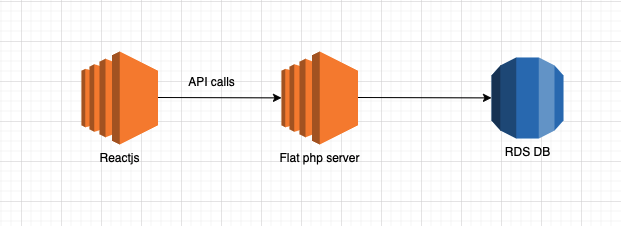

# Flat PHP Take home exam for Boozt


## Getting Started

```sh
cp .env.dist .env
docker-compose build
docker-compose up
```

### Prerequisites

* Docker

##### To get inside the docker
```bash
$ docker exec -it container_name_here /bin/bash
```


##### Once inside docker

```bash
$ composer install
```

## Webserver should be running on port 8000
